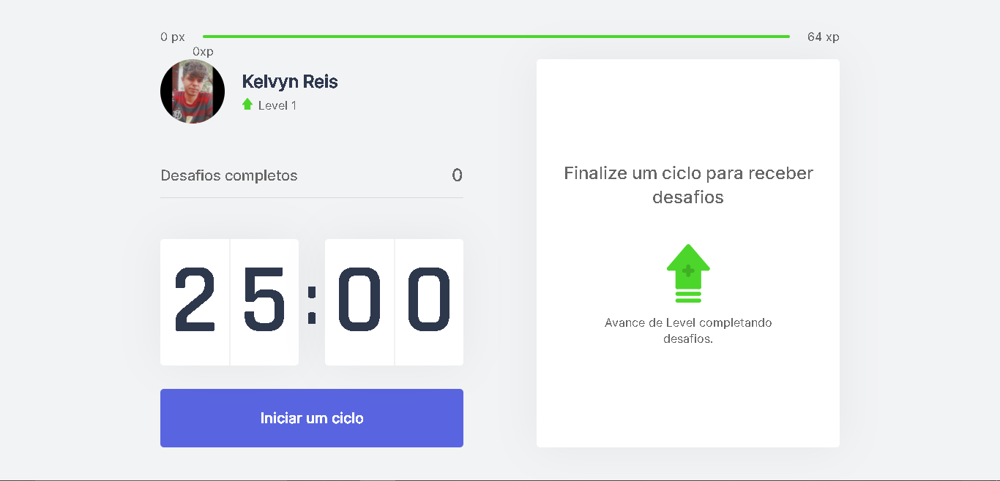

## Move.it 

<p align="center">
    
</p>

## 🚀 Projeto

O move.it é um aplicativo que utiliza a tecnica do pomodoro, esse app auxilia na utilização de exercicios físicos por pessoas que ficam muito tempo na frente de um computador.

##  🖌 Layout

O layout do projeto pode ser acessado pelo [Figma](https://www.figma.com/) atravês desse [link](https://www.figma.com/file/XD84pU0aqmnklZO9Na4atE/Move.it-1.0-(Copy)).

## 💻 Tecnologias

Neste projeto foi utilizado as seguintes tecnologias.

- [React.js](https://pt-br.reactjs.org/)
- [Next.js](https://nextjs.org/)
- [TypeScript](https://www.typescriptlang.org/)
- [styledComponents](https://styled-components.com/)

##  📚  Funcionalidades

- Inicia-se um ciclo a cada  25 minutos.
- Abandonar o ciclo
- È enviado um efeito sonoro a cada fim de ciclo.
- Cada ciclo libera um novo desafio.
- Cada desafio feito voçê ganha experiencia
- Usuario pode subir de nível.

## 🔧 Instalação 

Antes de começar, você vai precisar ter instalado em sua máquina as seguintes ferramentas:
[Git](https://git-scm.com), [Node.js](https://nodejs.org/en/). 
Além disto é bom ter um editor para trabalhar com o código como [VSCode](https://code.visualstudio.com/)


```bash
# Clone este repositório.
$ git clone https://github.com/Sogeking07/Nlw-4.git

# Vá para a pasta moveit-nlw4
$ cd moveit-next

# Instale as dependências
$ npm install 

# Execute aplicação
$ npm run dev

# O app vai está rodando na porta 3000 - acesse <http://localhost:3000>
```

## 😁 Autor


Feito com ❤️ por Kelvyn Reis 👋🏽 Entre em contato!

[](https://www.linkedin.com/in/kelvyn-dos-reis-511b201b9/)
[](mailto:kelvyn2reis@gmail.com)

## Licença

- Copyright © 2021 [Sogeking07](https://github.com/Sogeking07)
- This project is [GNU](https://github.com/Sogeking07/Nlw-4/blob/main/LICENSE) licensed.